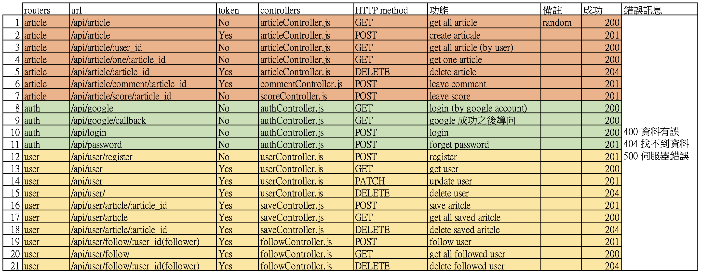
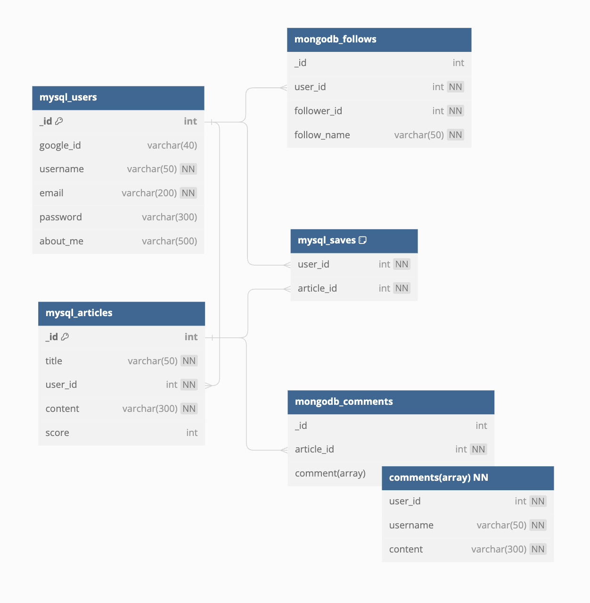
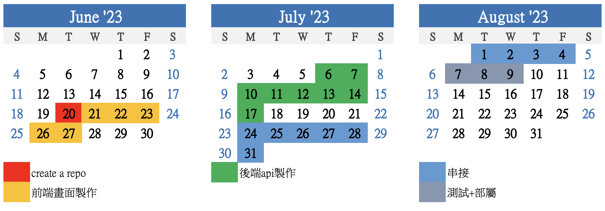
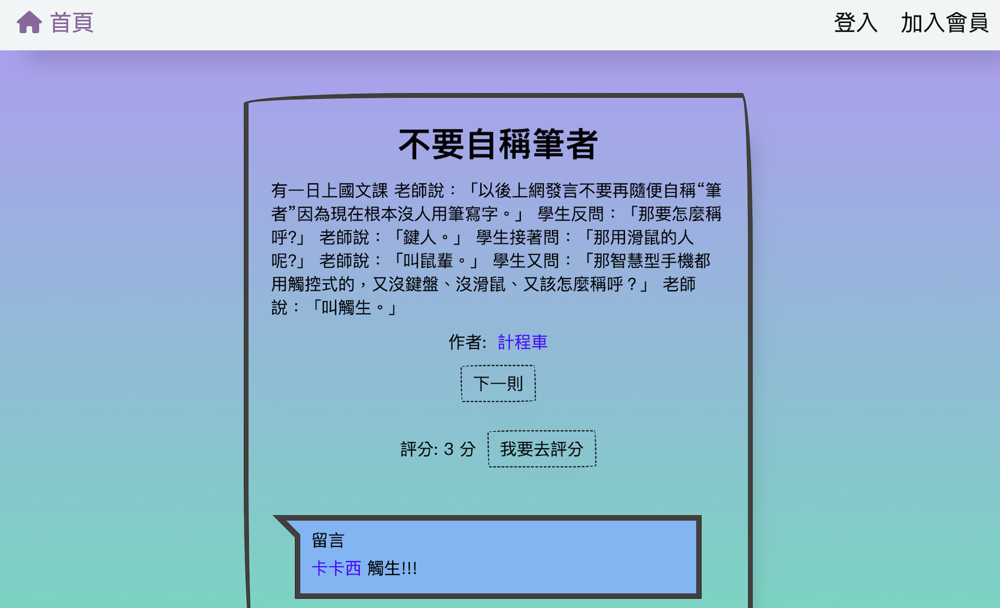
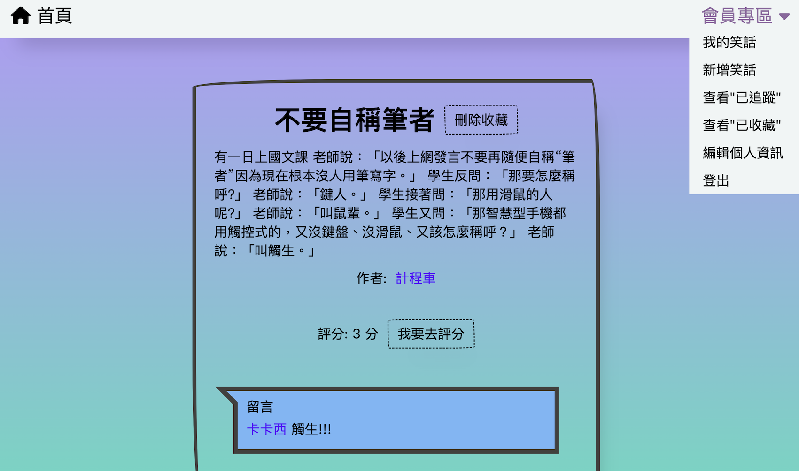

# Node-Station

前端使用 ejs 與 Vue3 、axios，後端使用 Node.js,Express 框架結合 AWS RDS MySQL 資料庫與 MongoDB 資料庫實作笑話評分網站，包含基本的 CRUD 功能、資料庫建置、Joi 資料驗證、JWT 登入驗證、Google 登入 第三方 API 串接、Nodemailer 發信功能，打造一個可以簡單收藏文章、追蹤作者、發表文章並評分、留言的文章評分系統。

## Swagger 文件



```
https://evening-chamber-46823-033e023efeaf.herokuapp.com/api-docs/
```

## 資料庫規劃



## 時間規劃



## 部署至 Heroku

```
https://evening-chamber-46823-033e023efeaf.herokuapp.com/
```

## 可使用帳號

```
User
Account: naruto@mail.com
Password: 123456

```

## 使用者可造訪的網頁與功能

### 訪客(未登入)



<首頁>

1. 可瀏覽文章資訊
2. 按作者可瀏覽該作者資訊與文章列表
3. 按"下一則"網頁會隨機挑選一篇文章
4. 按"我要去評分"可評分該文章
5. 按留言者可瀏覽該留言者資訊與文章列表

<作者資訊頁>

1. 可瀏覽該作者資訊與文章列表
2. 按文章可瀏覽文章資訊

<評分頁>

1. 可評分文章

<加入會員頁>

1. 註冊成為會員，網頁會寄一封密碼信至該信箱
2. 按"以 google 帳號登入"使用 google 第三方登入訪能

<登入頁>

1. 可以註冊帳號與信箱的密碼登入網頁
2. 按"以 google 帳號登入"使用 google 第三方登入功能
3. 按"忘記密碼"進入忘記密碼頁

<忘記密碼頁>

1. 可以註冊信箱取得新密碼

### 會員(已登入)



<首頁>

1. 可瀏覽文章資訊
2. 按作者可瀏覽該作者資訊與文章列表
3. 按"下一則"網頁會隨機挑選一篇文章
4. 按"我要去評分"可評分與留言
5. 按留言者可瀏覽該留言者資訊與文章列表
6. 按"收藏"收藏該文章

<作者資訊頁>

1. 可瀏覽該作者資訊與文章列表
2. 按文章可瀏覽文章資訊
3. 按"追蹤"追蹤該作者

<評分頁>

1. 可評分文章
2. 可留言

<我的笑話頁>

1. 可瀏覽個人資訊與文章列表
2. 按文章可瀏覽文章資訊
3. 按"刪除"可刪除該文章

<新增笑記頁>

1. 可新增笑話

<查看"已追蹤"頁>

1. 可查看已追蹤的作者列表
2. 按作者可瀏覽該作者資訊與文章列表
3. 按"刪除"可停止追蹤該作者

<查看"已收藏"頁>

1. 可查看已收藏的文章列表
2. 按文章可瀏覽文章資訊
3. 按"刪除"可移除收藏該文章

<編輯個人資訊頁>

1. 可修改更新個人資訊
2. 按"刪除此帳號"可刪除該帳號並登出

<登出頁>

1. 可登出

## Installing - 專案安裝流程

1. 開啟終端機，執行以下指令 :

> `$ git clone https://github.com/169628/nodestation.git`

2. 進入專案資料夾

> `$ cd nodestation`

3. 透過 npm 安裝套件

> `$ npm install`

4. 安裝 nodemon

> `$ npm install -g nodemon`

5. 新增 .env 檔案 (請參考 example.env 檔案)

6. 開啟 MySQL 資料庫

(1) 到 MySQL 創建 database

```
create database <mysql database名稱> default charset=utf8 collate=utf8_general_ci;
use <mysql database名稱>;

```

(2) 創建 table

```
create table users(
	_id int AUTO_INCREMENT PRIMARY KEY,
	google_id varchar(40),
	username varchar(50) NOT NULL,
	email varchar(200) UNIQUE NOT NULL,
	password varchar(300),
	about_me varchar(500));

```

```
create table articles(
	_id int AUTO_INCREMENT PRIMARY KEY,
	title varchar(50) NOT NULL,
	user_id int NOT NULL,
	content varchar(300) NOT NULL,
	score int,
	foreign key(user_id) references users(_id) on delete cascade);

```

```
create table saves(
	user_id int NOT NULL,
	article_id int NOT NULL,
	UNIQUE (user_id,article_id),
	foreign key(user_id) references users(_id) on delete cascade,
    foreign key(article_id) references articles(_id) on delete cascade);

```

7. 開啟 MongoDB 資料庫

8. 使用腳本啟動專案

> `$ npm run dev`

> 從瀏覽器進入 http://localhost:3000

## Environment & Tools - 環境&使用工具

- [Visual Studio Code 編輯器](https://code.visualstudio.com/)
- [Node.js (v16.14.0)](https://nodejs.org/en/)
- [Express 框架](https://www.npmjs.com/package/express)
- [bcryptjs](https://www.npmjs.com/package/bcryptjs)
- [cors](https://www.npmjs.com/package/cors)
- [dotenv](https://www.npmjs.com/package/dotenv)
- [ejs](https://www.npmjs.com/package/ejs)
- [joi](https://joi.dev/)
- [jsonwebtoken](https://www.npmjs.com/package/jsonwebtoken)
- [mongoose](https://www.npmjs.com/package/mongoose)
- [mysql](https://www.npmjs.com/package/mysql)
- [nodemailer](https://www.npmjs.com/package/nodemailer)
- [passport](https://www.npmjs.com/package/passport)
- [passport-google-oauth20](https://www.npmjs.com/package/passport-google-oauth20)
- [swagger-ui-express](https://www.npmjs.com/package/swagger-ui-express)
- [uuid](https://www.npmjs.com/package/uuid)
